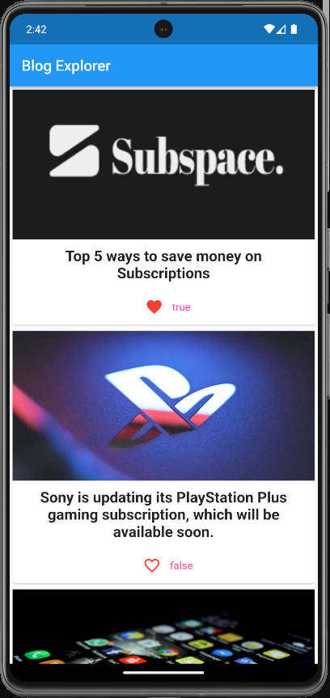
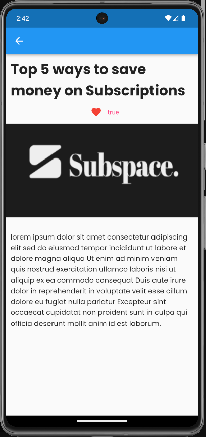

# Blog Explorer

A simple mobile app for viewing blogs. It is made using flutter.

It uses state management for fetching blogs from external API and displays each blogs in a nice List view.

## Getting Started

- Clone the repository
- Open the folder in termial
- Run the `flutter run` command to start using the app.

## ScreenShots
### Blog List Screen

### Blog Detail Screen

